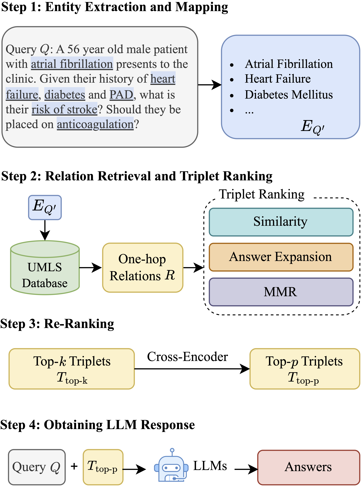
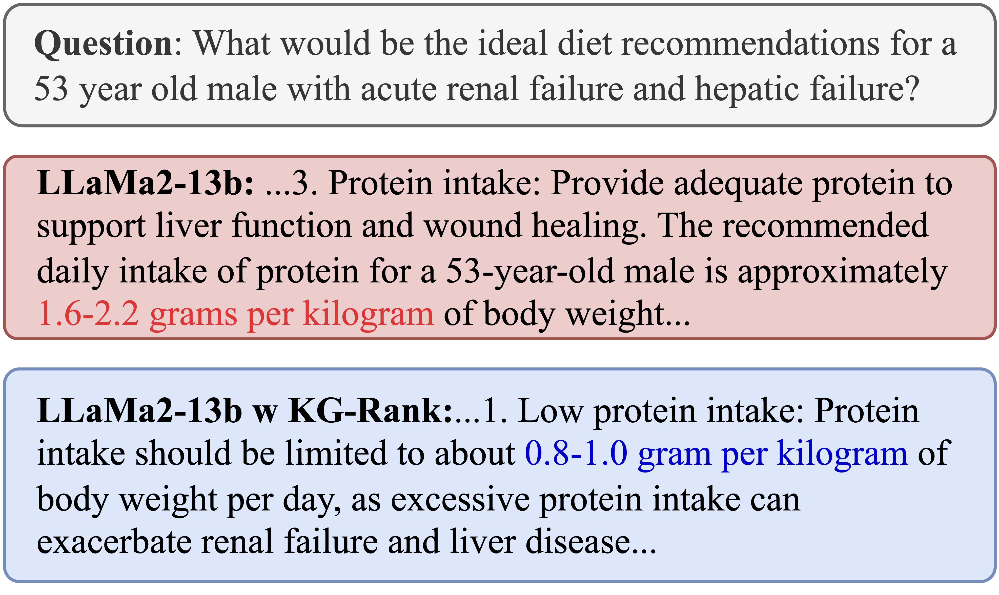
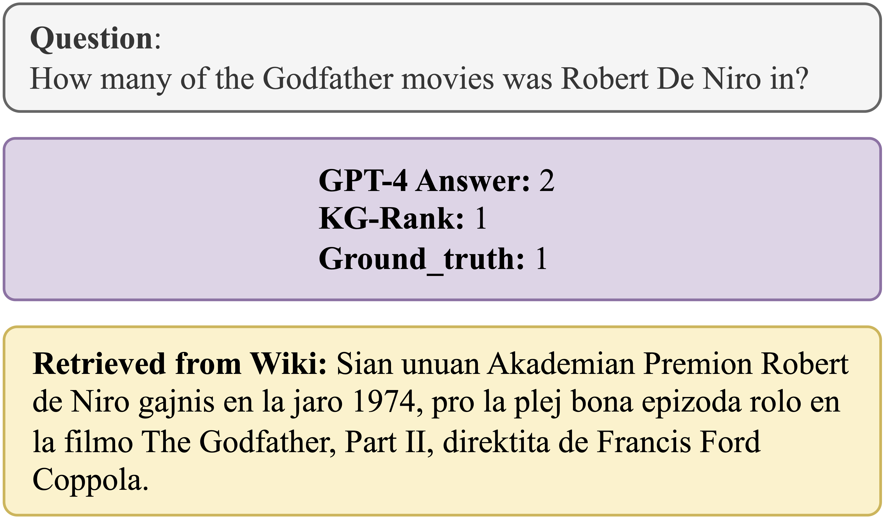

# KG-Rank: Enhancing Large Language Models for Medical QA with Knowledge Graphs and Ranking Techniques

Large Language Models (LLMs) have significantly advanced healthcare innovation in generation capabilities. However, their application in real clinical settings is challenging due to potential deviations from medical facts and inherent biases. In this work, we develop an augmented LLM framework, KG-Rank, which leverages a medical knowledge graph (KG) with ranking and re-ranking techniques, aiming to improve free-text question-answering (QA) in the medical domain. 

<!-- Framework -->
## KG-Rank Framework
<br> <!--  -->
<p align="center">
   
</p>

<!-- Contents -->
## Table of Contents
* [Data](#data)
* [LLM-based Evaluation](#llm-based-evaluation)
* [KG-Rank in Open Domains](#kg-rank-in-open-domains)
* [Case Study](#case-study)
* [System Demo](#system-demo)
* [Contact](#contact)
* [Citation](#citation)


<!-- Data -->
## Data 
We conduct experiments on four medical QA datasets, in which the answers are free-text. [LiveQA](https://trec.nist.gov/pubs/trec26/papers/Overview-QA.pdf) consists of health questions submitted by consumers to the National Library of Medicine. [ExpertQA](https://arxiv.org/pdf/2309.07852)  is a high-quality long-form QA dataset with 2177 questions spanning 32 fields, along with answers verified by domain experts. Among them, 504 medical questions (Med) and 96 biology (Bio) questions were used for evaluation. [MedicationQA](https://ebooks.iospress.nl/doi/10.3233/SHTI190176) includes 690 drug-related consumer questions along with information retrieved from reliable websites and scientific papers.

<!-- LLM-based Evaluation -->
## LLM-based Evaluation
KG-Rank achieves significant improvements in ROUGE, BERTScore, MoverScore, and BLEURT, however, these automatic scores have limitations in evaluating the factuality of long-form medical QA. Therefore, we introduce the GPT-4 score specifically for factuality evaluation. The evaluation criteria are designed by two resident physicians with over five years of experience.
### Evalution Criteria
|                     | **Description**                                                                                                                   |
|---------------------|-----------------------------------------------------------------------------------------------------------------------------------|
| **Factuality**      | The degree to which the generated text aligns with established medical facts, providing accurate explanations for further verification. |
| **Completeness**    | The degree to which the generated text comprehensively portrays the clinical scenario or posed question, including other pertinent considerations. |
| **Readability**     | The extent to which the generated text is readily comprehensible to the user, incorporating suitable language and structure to facilitate accessibility. |
| **Relevance**       | The extent to which the generated text directly addresses medical questions while encompassing a comprehensive range of pertinent information. |

<!-- KG-Rank in Open Domains -->
## KG-Rank in Open Domains
To further demonstrate the effectiveness of KG-Rank, we extend it to the open domains (including law, business, music,and history) by replacing UMLS with Wikipedia through the [DBpedia API](https://www.dbpedia.org/). KG-Rank realizes a 14% improvement in ROUGE-L score, indicating the effectiveness and great potential of KG-Rank.

<!-- Case Study -->
## Case Study
### Case Study in Medicine:

<br> <!--  -->
<p align="center">
   
</p>

### Case Study in Open Domains:

<br> <!--  -->
<p align="center">
   
</p>

<!-- System Demo -->
## System Demo
Early KG-Rank Demo (based on ChatGPT-3.5) <br> Creation Time: Oct 2023. 
<br> <!--  -->
<p align="center">
   
</p>

<!-- Contact -->
## Contact
Rui Yang: yang.rui@duke-nus.edu.sg <br>
Dr. Irene Li: ireneli@ds.itc.u-tokyo.ac.jp

<!-- Citation -->
## Citation

```bibtex
@misc{yang2024kgrank,
      title={KG-Rank: Enhancing Large Language Models for Medical QA with Knowledge Graphs and Ranking Techniques}, 
      author={Rui Yang and Haoran Liu and Edison Marrese-Taylor and Qingcheng Zeng and Yu He Ke and Wanxin Li and Lechao Cheng and Qingyu Chen and James Caverlee and Yutaka Matsuo and Irene Li},
      year={2024},
      eprint={2403.05881},
      archivePrefix={arXiv},
      primaryClass={cs.CL}
}

Previous Research:
@misc{yang2023integratingumlsknowledgelarge,
      title={Integrating UMLS Knowledge into Large Language Models for Medical Question Answering}, 
      author={Rui Yang and Edison Marrese-Taylor and Yuhe Ke and Lechao Cheng and Qingyu Chen and Irene Li},
      year={2023},
      eprint={2310.02778},
      archivePrefix={arXiv},
      primaryClass={cs.CL},
      url={https://arxiv.org/abs/2310.02778}, 
}

